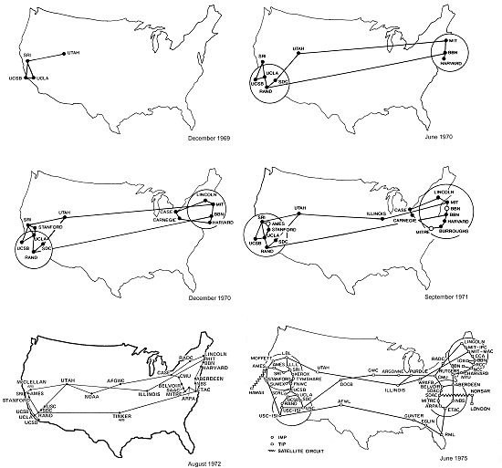
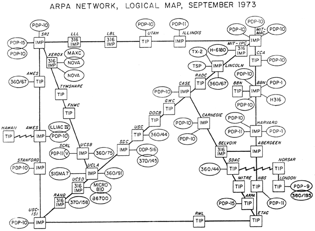

# Une brève chronologie du numérique

<iframe src='https://cdn.knightlab.com/libs/timeline3/latest/embed/index.html?source=1ZgnK7tp0L8hBm3_MwlHLURJoUwD0Ro7ydz3KyVyDHmM&font=Default&lang=en&initial_zoom=2&height=650' width='100%' height='650' webkitallowfullscreen mozallowfullscreen allowfullscreen frameborder='0'></iframe>

[La timeline en grand format](https://cdn.knightlab.com/libs/timeline3/latest/embed/index.html?source=1ZgnK7tp0L8hBm3_MwlHLURJoUwD0Ro7ydz3KyVyDHmM&font=Default&lang=en&initial_zoom=2&height=650)

__Exercices__ :

- Parcourir la timeline

- Répondre aux question sur Wooclap en cliquant [ici](https://app.wooclap.com/RQTZAO?from=event-page) ou en flashant le QR code ci-dessous

<!-- La timeline montre que le numérique est une histoire scientifique et technique, mais aussi une histoire politique à travers les institutions mises en place pour développer Internet et réguler le réseau, une histoire culturelle à travers les pratiques des outils numériques, leurs inscriptions dans des oeuvres littéraires (Azimov), cinématographiques, une histoire des transformations sociales (le télétravail, les sites de rencontre, les réseaux sociaux) -->

## Internet

Internet est le nom donné au protocole permettant à des ordinateurs de communiquer à distance, c'est-à-dire de s'échanger des informations. Ce protocole est le __TCP/IP__, qui signifie "Transmission Control Protocol/__Internet__ Protocol". Il a été mis au point en __1973__ par Vinton Cerf et Robert Kahn dans le cadre du projet __ARPANET__ initié en __1966__ sous l'égide de l'Information Processing Techniques Office (IPTO). L'IPTO est lui-même une subdivision de l'Advanced Research Projetcs Agency. L'ARPA est une agence mise en place en 1958 par le Département américain de la Défense en réponse à l'envoi du premier satellite Spoutnik par l'Union soviétique.

La première démonstration d'une communication en réseau entre deux ordinateurs a eu lieu le 9 décembre 1968 avec en vedette Doug Engelbart. Alors qu'Engelbert et son équipe étaient dans le San Francisco’s Civic Auditorium, ils ont réussi à interagir avec un autre ordinateur situé dans leur laboratoire de l'université de Stanford. C'est aussi la première fois qu'on a utilisé une souris. Efin, cette démonstration est considérée comme "the mother of all demos".

<iframe width="560" height="315" src="https://www.youtube.com/embed/yJDv-zdhzMY" title="YouTube video player" frameborder="0" allow="accelerometer; autoplay; clipboard-write; encrypted-media; gyroscope; picture-in-picture" allowfullscreen></iframe>

Un an après la démonstration, ARPANET permit de connecter les ordinateurs de la UCLA’s School of Engineering (Los Angeles) à ceux de la  (Menlo Park), de l'UC Santa Barbara et de l'université de l'Utah. En 1971, 23 organisations réparties sur les côtes est et ouest des USA étaient connectées à l'ARPANET, et en 1973 Londres rejoignait le réseau.

Au départ, l'ARPANET fonctionne grâce au protocole NPC (Network Protocol Program). Ce protocole pose toutefois 2 problèmes:

- La communication passe uniquement par les câbles téléphoniques, ce qui réduit son application militaire puisqu'il ne permet pas d'échanger des informations par radio ou satellite {cite:p}`abbateInventingInternet1999`.

- Il faut appartenir au même réseau. Ce qui rend plus difficile son usage académique par exemple.

Deux problèmes que le protocole TCP/IP (donc Internet) va permettre de résoudre. Dans les deux cas, les protocoles NCP (Arpanet) et TCP/IP (Internet) mettent en application le concept "switching packet" (communication par paquet) proposé par Paul Baran (Rand Company) et Donald Davies (National Physical Laboratory). Pour schématiser, la communication par paquet consiste à découper un message en morceaux et à les envoyer par différents canaux. Le destinataire se chargera ensuite de recoller les morceaux dans l'ordre pour reconstituer le message initial.

Ainsi, la communication par paquet permet de faire passer des informations via un réseau distribué. On parle de réseau distribué lorsqu'il existe plusieurs chemins entre un point A et un point B. Il s'oppose à un réseau centralisé. Les réseaux téléphoniques sont des réseaux centralisés. Le RER est un réseau centralisé : vous êtes obligés de passer par Paris (Gare du Nord) pour aller de Garge-Sarcelles au Bourget. Si on est piéton, on peut voir le système des rues du centre de Reims comme un réseau distribué.

Cette possibilité de communiquer via un réseau distribué est un des principes qui fait qu'Internet est une innovation __sociotechnique__. Technique, car il utilise un nouveau moyen de traiter l'information. Social, car il remet en cause par exemple le monopole des compagnies de téléphone sur le contrôle des communications.

# The Woman Dancing Emoji &#128131;

Les émojis est le thème imposé de cette année. Pour initier l'exercice d'implosion, on s'intéressera en particulier à l'émoji qui représente une femme en robe rouge en train de danser.

